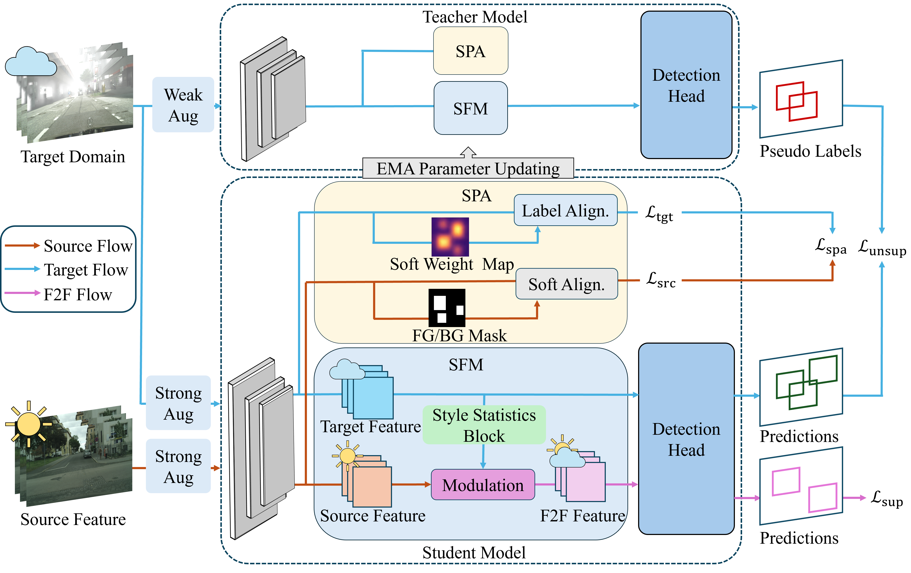

<div align="center">
# DA-F2F: Domain-Adaptive Object Detection with Feature-to-Feature Modulation and Alignment
</div>

<p align="center">
  
</p>

## Introduction

**DA-F2F** is a domain-adaptive object detection framework that directly performs domain transformation in the feature space.

Existing image-to-image translation based DAOD methods often suffer from unstable pixel-level artifacts and additional computational overhead. Instead of translating images, DA-F2F performs **feature-to-feature modulation**, transforming source-domain representations into target-aligned feature representations.

DA-F2F consists of two main components:

* **Style-Aware Feature Modulation (SFM)**
  Transfers target-domain style statistics to source features and generates target-aligned source representations.

* **Soft-Weighted Proposal Alignment (SPA)**
  Performs region-separated adversarial alignment with a soft-weighted strategy for robust foreground/background alignment in the target domain.


## Main Contributions

In this paper, we:

1. Develop **Style-Aware Feature Modulation (SFM)**, which implements feature-to-feature modulation by transforming source-domain representations into the target domain within the feature space.

2. Introduce **Soft-Weighted Proposal Alignment (SPA)**, which improves adversarial learning by stably separating foreground and background regions in the target domain.

3. Demonstrate strong performance across multiple domain shift scenarios, including weather adaptation, small-to-large scale dataset adaptation, and synthetic-to-real adaptation.

## Installation

```bash
conda create -n daf2f python=3.9 -y
conda activate daf2f

pip install torch torchvision
pip install -r requirements.txt
pip install -e .
```

## Dataset Preparation

Please organize the datasets as follows:

```text
datasets/
├── cityscapes/
├── foggy_cityscapes/
├── bdd100k/
└── sim10k/
```

## Training

### Cityscapes → Foggy Cityscapes

```bash
CUDA_VISIBLE_DEVICES=0,1,2,3 python tools/train_net.py \
    --config-file configs/cityscapes/da2od-cityscapes.yaml \
    --num-gpus 4
```

### Cityscapes → BDD100K-daytime

```bash
CUDA_VISIBLE_DEVICES=0,1,2,3 python tools/train_net.py \
    --config-file configs/bdd100k/da2od-bdd100k.yaml \
    --num-gpus 4
```

### Sim10K → Cityscapes

```bash
CUDA_VISIBLE_DEVICES=0,1,2,3 python tools/train_net.py \
    --config-file configs/sim10k/da2od-sim10k.yaml \
    --num-gpus 4
```

## Resume Training

```bash
CUDA_VISIBLE_DEVICES=0,1,2,3 python tools/train_net.py \
    --config-file configs/cityscapes/daf2f-cityscapes.yaml \
    --num-gpus 4 \
    --resume
```

## Evaluation

```bash
CUDA_VISIBLE_DEVICES=0 python tools/train_net.py \
    --config-file configs/cityscapes/da-f2f-cityscapes.yaml \
    --eval-only \
    MODEL.WEIGHTS path/to/model.pth
```

## Results

| Adaptation Scenario           | Detector     | Backbone      |  mAP |
| ----------------------------- | ------------ | ------------- | ---: |
| Cityscapes → Foggy Cityscapes | Faster R-CNN | ResNet-50-FPN | 60.5 |
| Cityscapes → BDD100K-daytime  | Faster R-CNN | ResNet-50-FPN | 46.9 |
| Sim10K → Cityscapes           | Faster R-CNN | ResNet-50-FPN | 69.9 |

## Model Zoo

| Scenario                      | Checkpoint  |
| ----------------------------- | ----------- |
| Cityscapes → Foggy Cityscapes | Coming soon |
| Cityscapes → BDD100K-daytime  | Coming soon |
| Sim10K → Cityscapes           | Coming soon |

